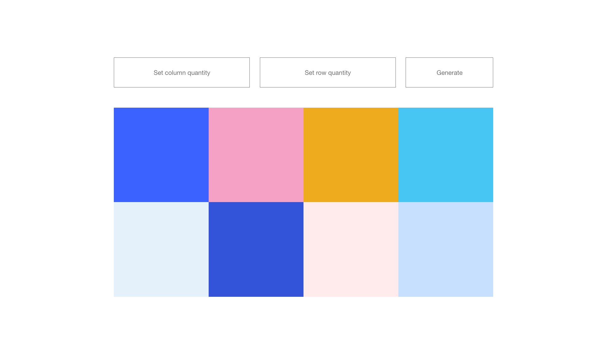

# Canvas API dancefloor

## Overview 
The main goal of the task is to create a interactive dance floor based on CanvasAPI.
The approach to achieve the task is free. We want to see how you solve problems and some basic algorithmic skills.

You can use all available resources and libs to achive the task except canvas manipulation that has to be native solution.
You can choose the way how you want to interact with the canvas. 

Basic UI mockup: 

## Requirements:
1. Please use native Canvas API without wrappers or libs
2. The flow of app initialization and view rendering should be as follow: 
    -> App bootstraping 
      -> Async operation to fetch the state (eg. You can simulate API call to recreate canvas with config) 
        -> UI and Canvas 
 
  
## Examples addons:

  - ~~Change square colours on document event like mouseover or onclick~~
  - ~~Prepare simple API to recreate canvas based on provided config (rows and columns quantity)~~
  - You can prepare transform animation
  - ~~You can combine all of previous examples~~
  - What you want but first ask! :)
  - Responsive dancefloor
 
 GOOD LUCK! :)
  
